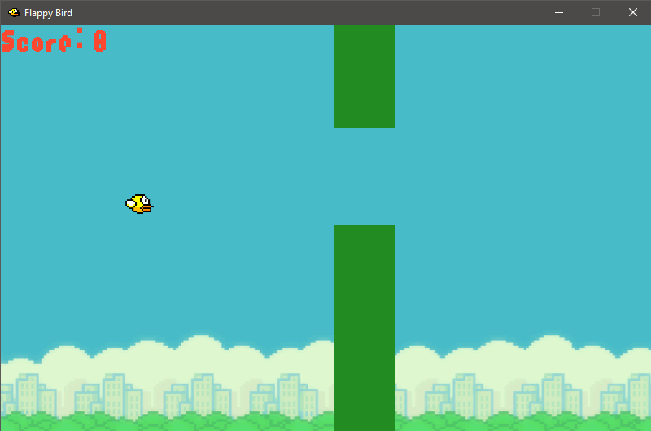
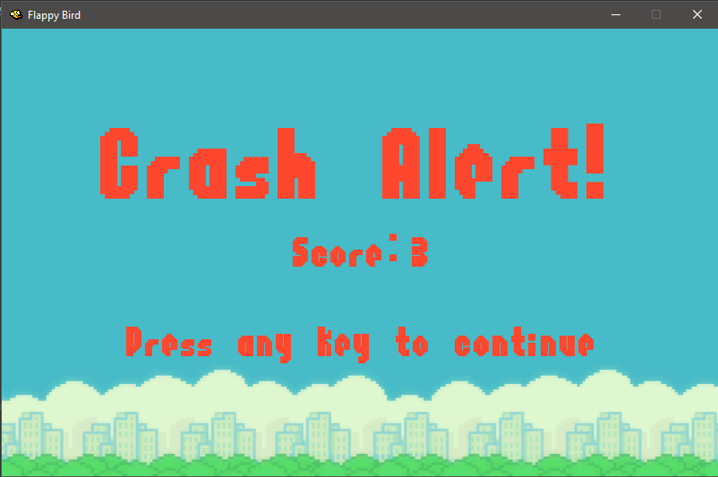

# Learning_python
I am trying to learn complete python and all advanced techniques. I will post all small projects I complete in this repository.

## 1. Flappy Bird Clone
This is a clone of the flappy bird game. It is built using pygame library in python. This game includes obstacles and simple up arrow to control the birdy.

###### Acknowledgements
- Thanks to **Radomir Dopieralski** for the amazing and easy to use pygame to excutable converter.
https://bitbucket.org/thesheep/ (His bitbucket account)

- Stone river learning for the easy to understand course on pygame.

###### How to play the game
Clone the repository and double click on the **start.bat** file to run the game.
